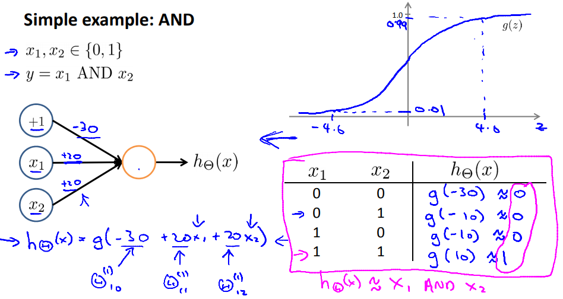

# Examples and Intuitions I
具体例を用いてニューラルネットワークを直感的に分かるようにする  

## ニューラルネットワークの具体例 AND
x1, x2がともにバイナリ(0/1)であるとき  
AND(共に1のときのみ1)をニューラルネットワークで表現することを考える  
  
上記の通り パラメタ(-20, 10, 10)を設定することで ANDは実現できる  
// 右上に復習としてシグモイド関数について記載してくれている  
// シグモイド関数は x<=-4.6でyはほぼ0 x>=4.6でyはほぼ1  

このニューラルネットワークの出力は上記の 右下の表の通りであり  
シグモイド関数のパラメタに-30や-10指定時は(-4.6より小さいので)ほぼ0  
同様に10指定時は(4.6より大きいので)ほぼ1となり ANDが実現できている  
