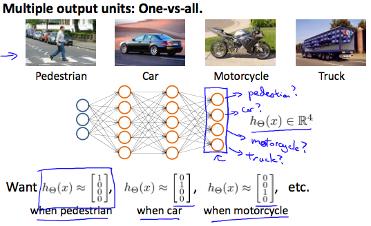

# Multiclass Classification
ニューラルネットワークでClassification(分類)する場合を扱う  

## ニューラルネットワークのClassification
画像をInputし ニューラルネットワークで  
4種(歩行者/車/バイク/トラック)に分類する場合を考える  
  
この場合 ニューラルネットワークでは  
上記の通り4次元ベクトルでOutputし判別する  
