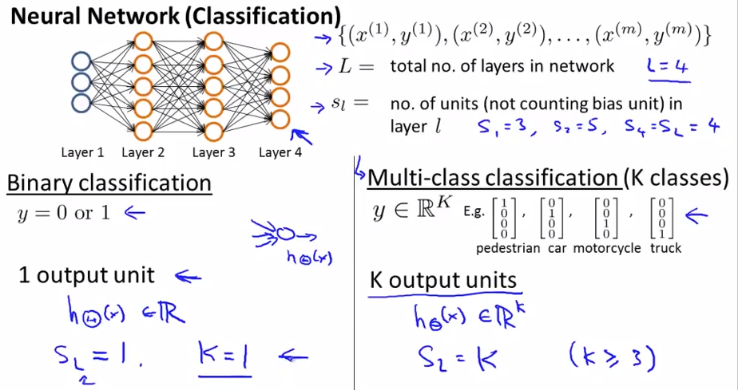
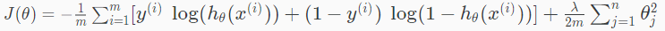
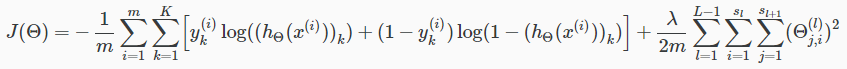

# Cost Function
ニューラルネットワークのパラメタをフィッティングするため  
まずはCostFunctionについて扱う  

## NeuralNetworkのCostFunction 用語
ニューラルネットワークのCostFunctionで使用する変数について定義する  
* L: ネットワークのレイヤ数  
* : lレイヤのユニット数(バイアスユニットは含めない)  
* K: 出力 ユニット/クラス の数  

例えば 以下ニューラルネットワークにおいては各変数は以下の通り  
  

## NeuralNetworkのCostFunction 式
LogisticRegressionにおいて 正規化したCostFunctionは以下であった  
  

ニューラルネットワークにおいてはCostFunctionは以下の通り  
  
結局 CostFunction算出にはなどを使う訳でなく いままで同様hθ(x)を用いる  
// a2やa3はhθ(x)を求めるための途中式  

これもいままで通りだが は  
あるパラメタ(θ=weight)を持つ仮説へ i番目のTrainingSetを入力したときの予測値  
そのため をMatrix(行列)で表現する場合  
例えば m=5000, K=10のときには5000 \* 10 のMatrixになる  
Row=5000は各TrainingSetに対応し(Row=iはi番目のTrainingSetに対する予測値のRow)で  
Column=10は各分類に一致する確率を示す(Column=kはkに分類される確率を示すColumn)  

0-9の手書き数字を分類する場合(数字0はColumn=10に対応 それ以外は数字=Column)  
以下のようなMatrixになる  
> 0.00000041683 0.00278374119 0.00061651823 0.00020149590 0.01002627344 (続く)  
> (続き) 0.00390395084 0.00280352075 0.00012113098 0.00122274720 0.99892095839  
> 0.00000252829 0.00181349964 0.00115903395 0.00011131135 0.02797962071 (続く)  
> (続き) 0.00077031489 0.00577992694 0.00003248392 0.00042928333 0.99843622150  

この2つのトレーニングセットはどちらも 数字0である確率が一番高いことを示している  

つまりCostFunctionの式も いままでとあまり大きな違いは無く  

前項のSummationは 全TrainingSet(m)の 全分類(K)の予測値(確率)の合算を指しており  
その際 それに分類するのが正解の場合(が1の場合)  
log(hθ(x))した値 つまり hθ(x)が1に近ければ近いほど0に近くなる値 を加算し  
// 1に近い値が正解で このときCostに加算する値は小さくしたいので 意図通り  
逆に それに分類するのが正解でない場合(が0の場合)  
log(1 - hθ(x))した値 つまり hθ(x)が0に近ければ近いほど0に近くなる値 を加算 を指す  
// 0に近い値が正解で このときCostに加算する値は小さくしたいので 意図通り  

後ろのSummationは 全weight つまり OutputLayerを出したときのweightだけでなく  
HiddenLayerを出したときのweightもRegularized対象と言っているだけ  
