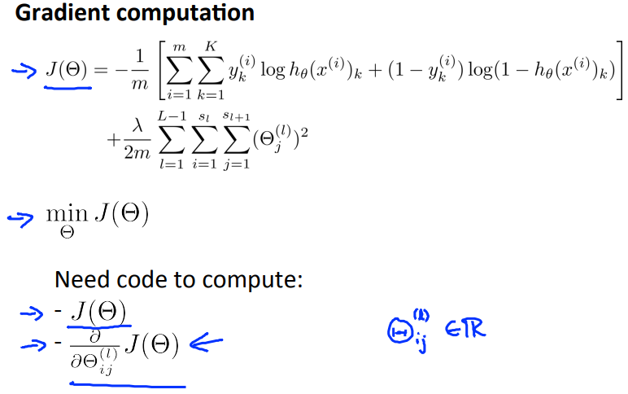
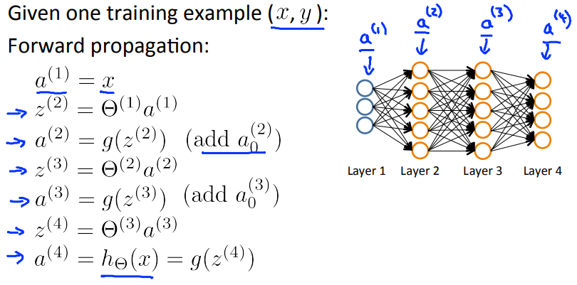
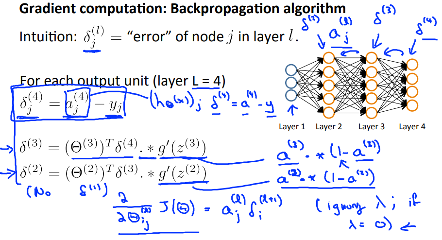
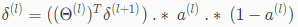
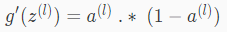
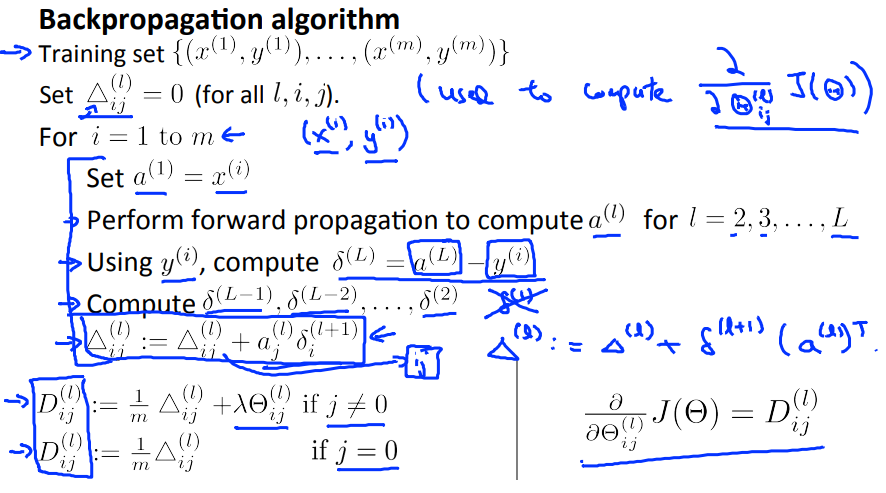

# Backpropagation Algorithm
NeuralNetworkのCostFunctionを最小化する  
BackpropagationAlgorithmについて扱う  

## NeuralNetworkで最適なパラメタ(θ)を求めるには
最適なパラメタ(θ)を求めるためにはNeuralNetworkでも  
LinearRegressionやLogisticRegressionと同様 J(Θ)を最小化すれば良い  
  
J(Θ)を最小化するためには LinearRegressionやLogisticRegression同様  
を求める必要がある  
これを求めるためにBackpropagationを用いる

## Backpropagationの考え方
Backpropagationの手順を把握するため  
簡単な例としてトレーニングセットが1件の場合で考える  

まずはForwardPropagationで 各レイヤのActivationNodesを求めて行き  
(仮説関数)を求める(以下の例ではL=4のため a(4)を求める)  
  

次に 求めたと y(トレーニングセットの実測値=答え) を用いて  
つまりOutputLayerの予測値と実測値の差異を求める  
  
同様にと求める  
// はInputLayerで予測値は無いため求めない  

δを求めるには以下の式を用いる(らしい よく分かってない)  
  

g(z)の微分は以下になる(らしい よく分かってない)  
  

## Backpropagationの式
m個のトレーニングセットについて考える場合は  
1番目のトレーニングセット, 2番目の, ...と各トレーニングセットについて考える  
  
この結果のが  
(らしい よく分かってない...)  
