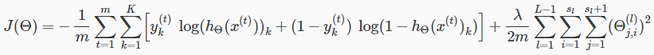
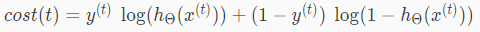
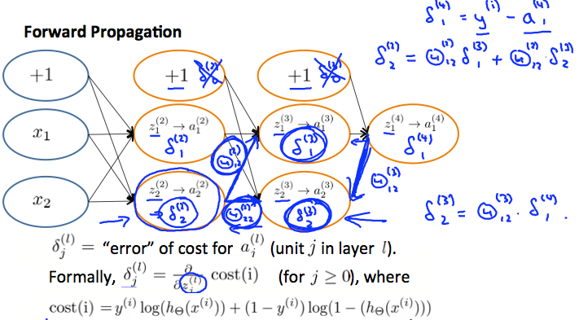

# Backpropagation Intuition
前出の 難しいBackpropagationの理解を進めるための より簡単な説明  
Backpropagationを詳細に理解することは難しいという認識で問題はないっぽい  

## Backpropagationが何をしているか
前出の通りNeuralNetworkのCostFunctionは以下  
  

Backpropagationを考え易くするため CostFunctionを以下シンプルなケースで考える  
　出力ユニット数が1(K=1) かつ Regularization(正規化)を無視  
このとき t番目のトレーニングセットについて考える場合 CostFunctionは以下
  
このCostFunctionは以下の式(誤差の2乗)と似たような役割    

前出の通りBackpropagationは以下の図の右から左に流れるように計算する  
  
Backpropagationの計算イメージは  
は上記の通りみたいなもの  
のようなもので  
続けて求めていくと と求められる のようなイメージ  

δを求める本来の式は以下(らしいけど なんでこうなるかは未だに理解できていない)  
  
けどまあ 正確に理解できてなくても問題はないらしい  
