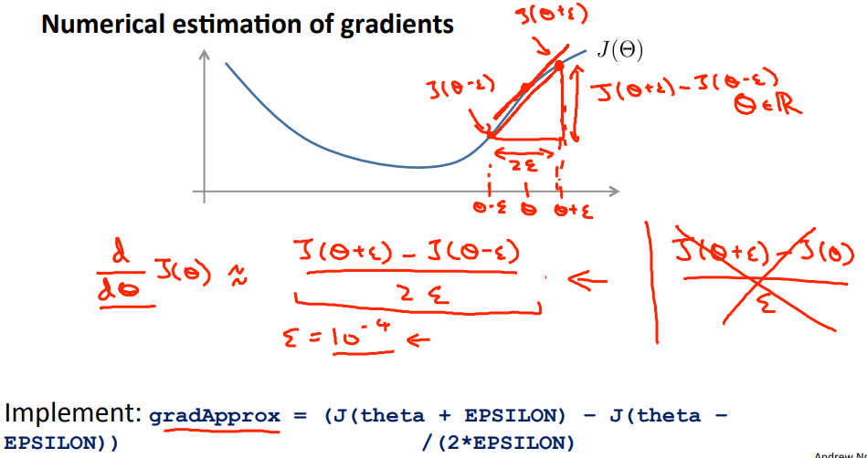
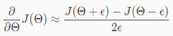
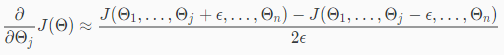
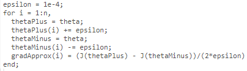

# Gradient Checking
Backpropagationでパラメタを求める際  
不当なGradient(微分係数=D)を導き出すバグを作り込み易い(らしい)  

対策のため 求めたGradientが妥当か確認する方法Gradient Checkingについて扱う  

## Gradient Checkingとはなにか
Gradient Checkingとは Backpropagationで求めたGradientと  
別の方法で求めたGradientを比較し 近い値であることを確認することで  
Backpropagationにバグがないことを確認すること を指す  

## Gradient Checkingの使い方
ここでは 以下の方法で おおよそのGradientを求めることを考える  
  
これは以下の式に相当  
  
εはくらいの値が適切らしい

θjについては以下の式で表すことができる  

Octaveで実装すると以下  

GradientCheckingを適用する場合 以下の手順  
1. BackpropagationでGradient(DVecつまりunrolledなD)を求める  
1. 上記したような方法でgradApproxを求める  
1. BackpropとgradApproxの結果が似た値であることを確認する  
1. Backpropagationで妥当なGradientが求められていることを確認できたら  
  GradientCheckingは無効にする  
  gradApproxを求める処理は遅いため 確認できたら無効にする  
