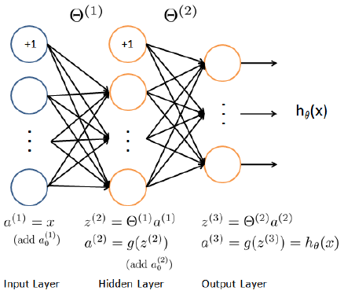

# Neural Network Learning
プログラミング課題: Neural Network Learning の Note  
手書きの数字(0-9)画像をNeuralNetworkで識別することについて扱う  

## submit 1
課題1は  
NeuralNetworkのCostFunctionを実装しコストJ(θ)を求めよ というもの

まず h(θ)を求める  
    
ForwardPropagationを用いる  
* X(トレーニングセット): 5000\*400 Matrix  
  5000件のトレーニングセット  
  画像は20*20pixelのため Vectorizedされ400
* パラメタ(Theta1, Theta2): HiddenLayerは1つで Unit数は25と指定されている  
  * Theta1: 25\*401のMatrix  
    a2のUnit数 \* 入力に対応するweight(BiasUnit分で+1)  
  * Theta2: 10\*26のMatrix  
    OutputLayerのUnit数(0-9に対応) \* a2のUnit数(BiasUnit分で+1)  
* a2(HiddenLayer): 25 \* 5000のMatrix  
  各Columns(5000)が示すのは  
