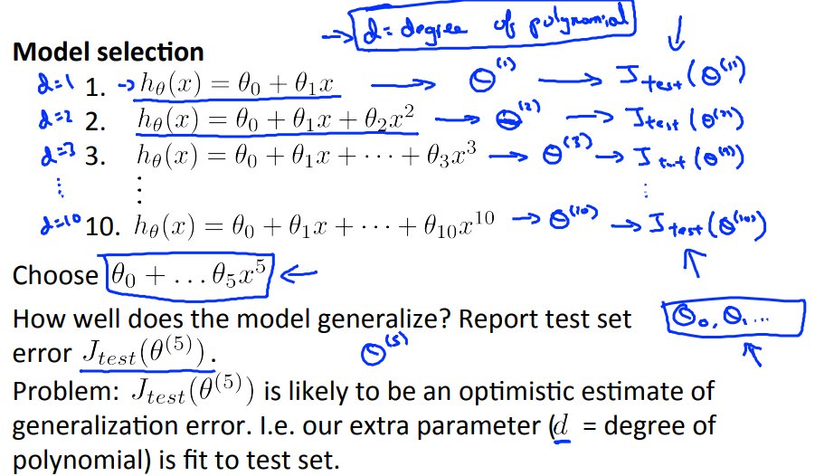
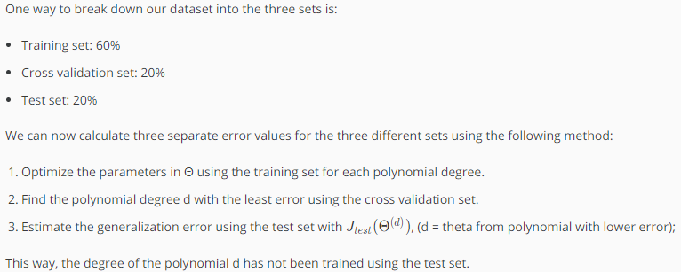

# Model Selection and Train/Validation/Test Sets
https://www.coursera.org/learn/machine-learning/lecture/QGKbr/model-selection-and-train-validation-test-sets  
妥当な次数の求め方について扱う  

## モデル(次数)選び の考え方
一から十次関数のモデルで どれが妥当か考える場合  
    
まず TrainingSetを使い それぞれのモデルにおいての  
パラメタ()を求める  
次に 求めたパラメタを適用した仮説で TestSetにおいての差異を求め  
差異が最小になるモデルを選ぶことで 妥当な次数を選択できる  

しかし これだとTestSetを用いて 仮説(のモデル)を選択しているため  
TestSetへの適合度は当然高くなるので 仮説の評価を適切に行うことができない  

## モデル(次数)の選び方
TrainingSetをTrainingSet/CrossValidationSet(CV)/TestSetの3種に分割し  
モデル選択にはCVを用いることで モデル選択・仮説評価の両者を正しく行なえる  
  
