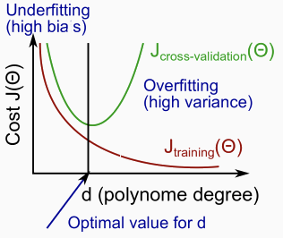

# Diagnosing Bias vs. Variance
仮説が良い予測をできないとき Under/Over Fitting が発生していると考えられる  
Costを使い どちらか判別する方法について扱う  

## UnderFitting, OverFittingの見分け方
TrainingSetとCVSetについて Cost と 仮説関数の次数 について  
2次元グラフにプロットすると以下のようになる  
  以下をプロット  
*  : TrainingSetのCost  
*  : CrossValidationのCost  

  
つまり 仮説関数の次数を増やせば増やすほど  
Fitting対象のTrainingSetに対しFitするけれど(OverFitting傾向)  
やり過ぎると(OverFittingしてしまうと)未知データに対しての予測は誤差が大きくなる  

* TrainingSetのCostが高く CrossValidationのCostも高い場合 UnderFitting  
  (グラフの左側に見られる傾向)  
  予測値と実測値の差異が大きいので フィットできていない  
* TrainingSetのCostが低く CrossValidationのCostが高い場合 OverFitting  
  (グラフの右側に見られる傾向)  
  学習データに対しての予測は ほぼ誤差がないのに  
  未知データに対しての予測は 大きな誤差がある これはOverFitting  
