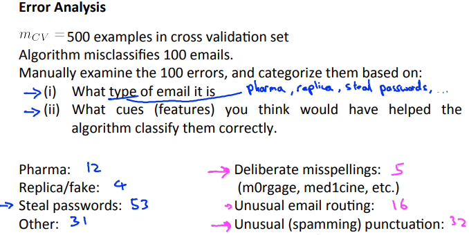

# Error Analysis
https://www.coursera.org/learn/machine-learning/lecture/x62iE/error-analysis  
MachineLearningの課題に取り組むとき どのように始め 進めて行けば良いか という話  

## MachineLearningの始め方・進め方
MachineLearningを始めるときは 以下のようなアプローチを採ることを推奨  
* シンプルな仮説をすぐ(24時間以内)につくり CVに対する誤差を出し  
  LearningCurveをプロットしてみる
* LearningCurveから Under/Over Fitting どちらが発生しているか確認し  
  もっとデータが必要か もっとFeatureか など 次に何をすべきか決める  
* CVの誤判定データを確認し なぜ誤判定したかエラー分析し Featureを改善する

## エラー分析
エラー分析は以下のように考える 例えばCVが500件あり うち100件を誤分類していて  
誤判定の原因を分析した結果 それぞれ以下のような原因・件数だった場合
  
StealPasswordsの誤分類が多い(53件) StealPasswordsのメールにどのような特徴があるか  
分析してみるのはプライオリティが高い(仮説の精度向上に有効に寄与しそう)  

また どんなアルゴリズムを作成・適用すれば精度を上げられそうか考えるとき  
誤分類には UnusualPunction(句読点のこと "!"なども含む?)が多い(32件)が分かるため  
これを判別できるアルゴリズムを作成・適用することは時間をかける価値がある  
// 実際スパムは"!"を多用する傾向などがあるらしい  

逆にmisspellingsは誤分類が少ない(5件)ため時間をかける価値があまりないことが分かる  

このようなことを考えるためにも シンプルな仮説をすぐにつくってみることが大切  

また 誤差を得られるようにしておけば  
Featureやアルゴリズムの変更が有効に機能しているか 判断することができる  
