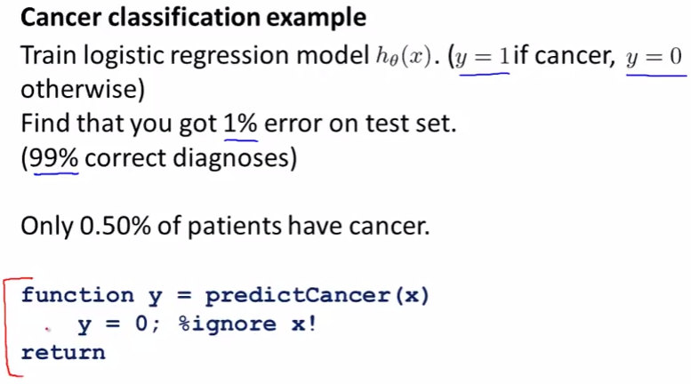

# Error Metrics for Skewed Classes
前出の通り FeatureやアルゴリズムなどMachineLearningの精度を上げるためには
エラー分析やエラーメトリクス(どれだけ正確に予測できているかの実数値の評価指標)が重要  
ここではエラーメトリクスについて扱う  

## エラーメトリクス
TestSetに対する誤差のみで予測の精度を計ると 精度を上手く計れないことがある  
例えば以下のケース  
  
つまり Cancer(1と分類すべきSet)が0.5%しか存在しない場合  
仮説が常に0を予測(例えばfeatureを無視し常に0)しても99.5%で予測は正解となってしまう  
この仮説は Cancerであることを全く正しく予測できないが 高いAccuracyとなってしまう  

このようにDataSetのyが0または1の片方に凄く偏っているものをSkewedClassesと呼ぶ  

SkewedClassesのエラーメトリクスは 以下が有効  
  
RareClassをy=1と置き この方法で計ることで  
常に0を返してしまうような仮説は低い精度として扱える(分子が0となるため)  

* Precision: 1として分類(予測)したものが 実際に1だった割合  
  下記表だと 80 / (80 + 20) = 0.8  
  100個を1と予測したけどうち20個は外れてた
* Recall: 1として分類(予測)したものが 実際の1をどれだけ捉えられていたかの割合  
  下記表だと 80 / (80 + 80) = 0.5  
  実際160個の1と分類すべきものがあるけど 予測ではうち80個だけ捉えていた  

/|001|000|  
1|080|020|  
0|080|820|  
