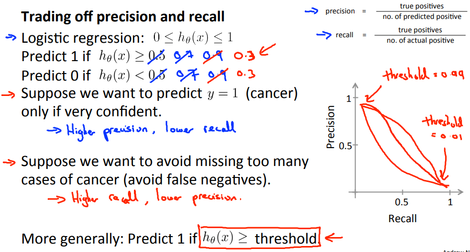
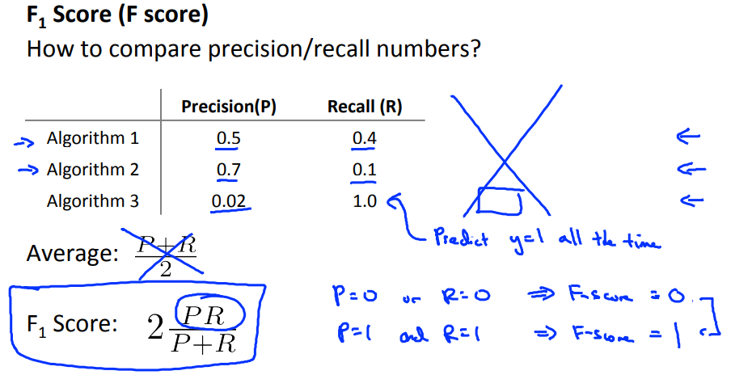

# Trading Off Precision and Recall
https://www.coursera.org/learn/machine-learning/lecture/CuONQ/trading-off-precision-and-recall  
SkewedClassの分類で使用するPrecisionとRecallのTradeOffについて扱う  

## PrecisionとRecallのTraceOffの考え方
Precisionは分類1と予測したものが実測に1であった割合で  
Recallは1に分類すべきものをどれだけ実際に1に分類できたかの割合だった  
// これらの値は両方とも1になるのが理想だが 実際はなかなかそうはならない(のだと思う)  

PrecisionとRecallをTraceOffするには  
1に分類する閾値(いままで0.5にしていたもの)を変えれば良い  

以下のようにPrecisionとRecallをTraceOffできる  
  
* 1に分類する閾値を大きくすれば Precisionは上がり Recallは下がる  
  つまり より確信を持てるものだけ1に分類するため  
  1と予測したものが実際に1である確率は上がる  
  しかし 1と分類すべきもので 取りこぼすものが増える  
* 逆に 1に分類する閾値を小さくすれば Recallは上がり Precisionは下がる  

## 最適なPrecisionとRecallの求め方
最適な閾値を考えるには　F1スコアが使用できる  
  
単純に考えると(P+R)/2で最適な閾値を選択できると考えられるが この方法だと  
上記Algorithm3(常に1と予測してしまうようなAlgorithm)が最適となってしまい適さない  
F1 Scoreを用いることで最適な閾値を選択できる  
