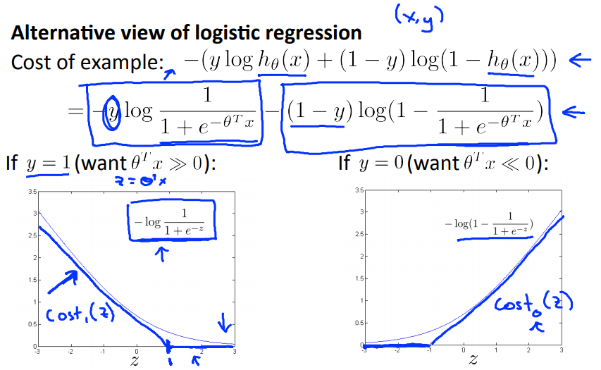

# Optimization Objective
ここから新しいアルゴリズムSupportVectorMachines(SVM)を扱う  
今回は特にCostFunctionを扱う  

## Support Vector Machines(SVM)のCostFunciton
SVMはLogisticRegression同様 分類を行なうための 教師ありアルゴリズム  

CostFunctionの考え方はLogisticRegressionに似ていて  
前出の通り LogisticRegressionのCostは以下の細い曲線で示されたが  
SVMでは以下の手書きの太線のようにCost算出する  
  
つまり SVMのCostはz()が1/-1を超えると常に0とし  
それ以外のzでは LogisticRegressionの傾きに似た変化をする直線  

また 表現するとき y=1のCostを 0をと表す  

SVMのCostFunctionは以下でLogisticRegressionとほぼ同じ  
  
LogisticRegressionではReguralized項のペナルティにλ/2mを使ったり  
CostのSummation項に1/mをかけたりしていたのに対し SVMでは異なる形を採る  

LogisticRegressionのパラメタλ(Regularization項への係数)に対し  
SVMのパラメタC(CostのSummation項への係数)は 1/λ の関係にある  
