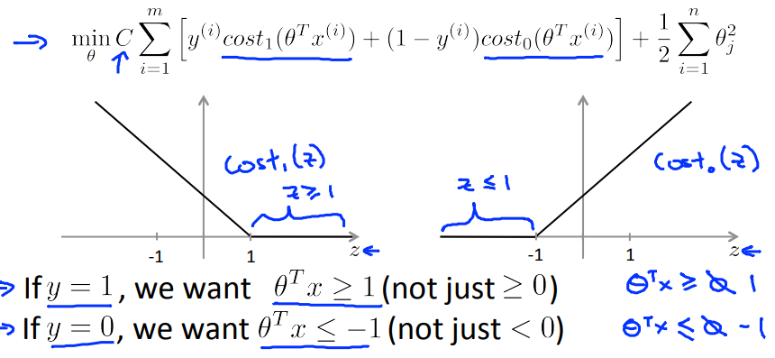
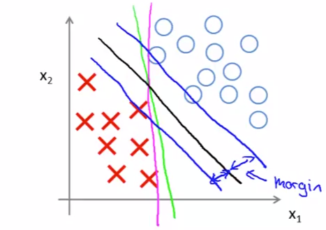
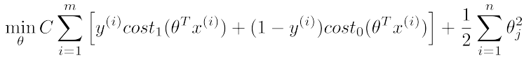
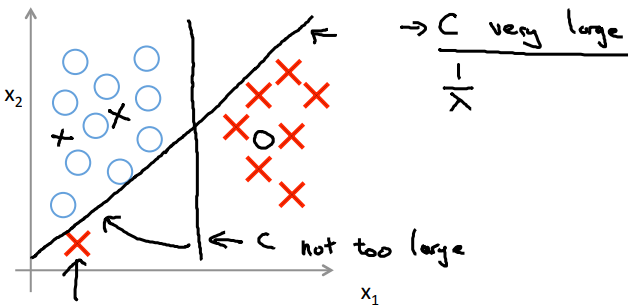

# Large Margin Intuition
ClassifierのMarginについて扱う  

## Marginとはなにか
前回の通りSVMのCostは以下の通り扱いたい  
  
上記にある通り `z>=0` や `z<0` を満たす時点で`Cost=0`にするのでなく  
`z>=1` や `z<=-1` を満たす時点で`Cost=0`として扱っている  

これは仮説のパラメタにMargin(余裕)を持たせるために有効  

パラメタにMarginを持たせると言うのは以下を指す  
  
つまり DicisionBoundryの線が いかに余裕(データと距離)を持てているか  
上記のどの線も現状のデータに対しては妥当なDicisionBoundry  
しかし 緑線はMarginが少なく 既存データと少し傾向が異なるだけで分類を誤る  
対して 黒線はMarginが大きく取れておりより妥当な分類が可能と考えられる  

前回扱った通り SVMのCostFunctionは以下の通りで  
  
CostのSummationを求める前項には係数Cがpenalizeされており  
これを大きくすると より大きなMarginがとられる

つまり Cが非常に大きいと  
以下の通り DataSetに対し大きなMarginをとるDicisionBoundryが導かれる  
  
