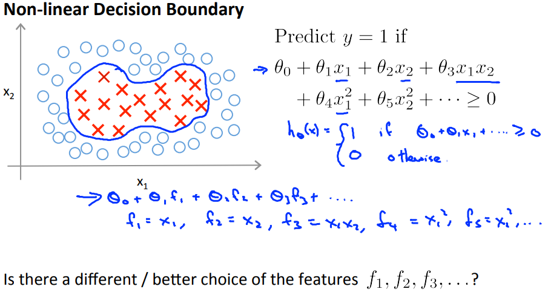
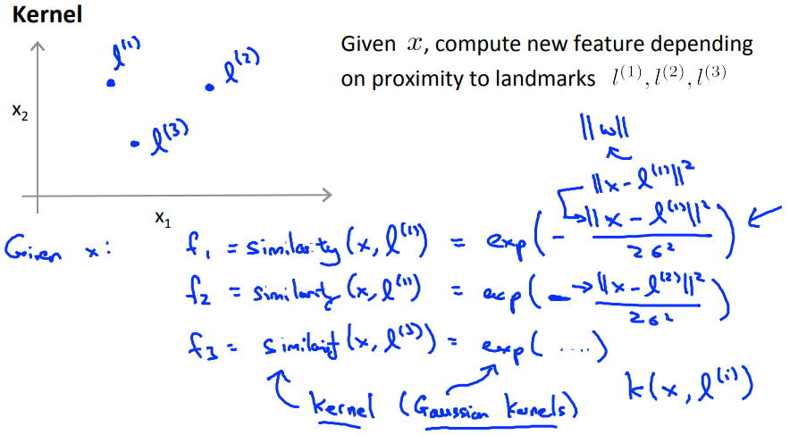
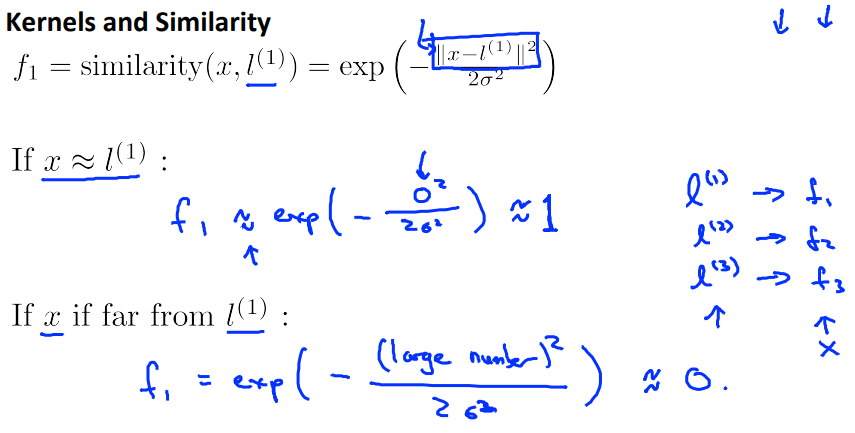
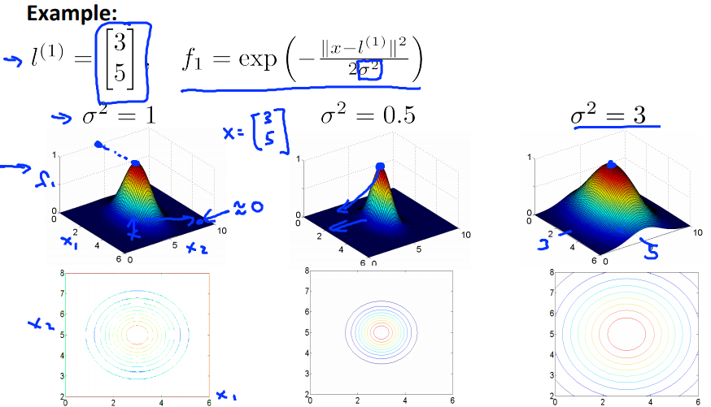

# Kernels I
SVMで複雑な非線形の分類するときに用いられているKernelsの考え方について扱う  

## Kernelsの考え方
以下DataSetを分類するDicisionBoundryは  
イメージでは左のグラフの通りで 式は右にある通りとなる  
  
ここから変数f1, f2, f3, ...を用いる  
これは 今回の式ではそれぞれx1, x2, x1x2, ...に対応する値を指すもの  

以下のようなLandmark l(1), l(2), l(3)が与えられたとき  
f1, f2, f3を xとそれぞれのLandmarkとのSimilarity(類似度)で求めることを考える  
// なぜそういう発想になっているのか理解できていない...  
ここれでSimilarityを求める関数はガウスカーネルと呼ばれるもの  
  

Similarityで求めている値は2つの点(f1だったらxとl(1))がどれだけ類似しているか の値  
  
つまり xがl(1)とほぼ同じ点を指すとき 上記の通り f1は ほぼほぼ1となる  
逆に xとl(1)が全然異なる点を指すとき 上記の通り f1は ほぼほぼ0となる  

σは以下の通り 作用する  
  
つまり Similarity(f1)が1(ほぼ同じ点を指すことを示す値)になるときの  
l(1)が`点[3; 5]`であることは どのσでも同じだが この点から離れるとき  
σが小さいと急激に0に近づき σが大きいと緩やかに0に近付く  

以下の関数について パラメタ(θ)を以下の通り定めているとき  
一番l(1)に近い青点についてf1, f2, f3を求めると それぞれおよそ1, 0, 0となる  
// l(1)には類似度が高い点なのでf1は1 それ以外のl(2), l(3)からは遠いので0  
  
当該の青点について仮説関数にf1, f2, f3を与えたとき 値は0.5で0以上のため1に分類される  

このような考え方でSVMは考える  
(らしい...? Similarityは分かったけど SVMは未だよく分からない)  
