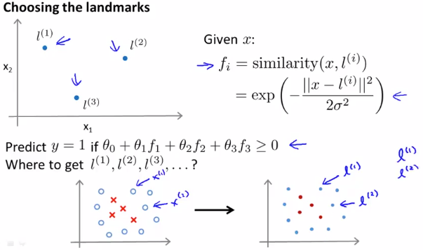
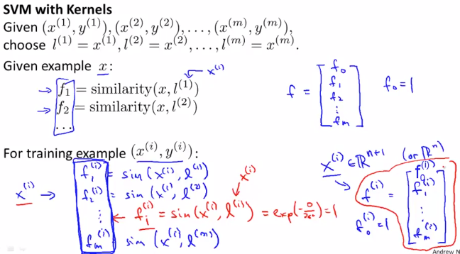
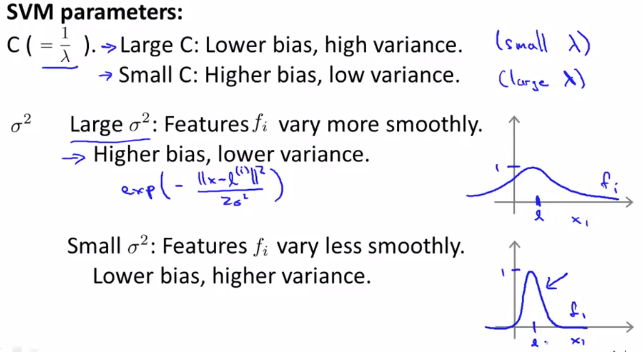

# Kernels II
続けてKernelsについて扱う  
今回は特に実践でどのように使用するかと Bias-VarianceのTradeOffについて扱う  
// 日本語字幕がないため理解があやしい...  

## Landmarkの決め方
Landmarkはトレーニングセットのxをそのまま使用すれば良い  
以下 左下グラフの通りDataSetがあるときは 右のようにLandmarkを設定すれば良い  
  

i番目のDataSet()からは以下の通り ベクトルのFeatureが求められる  
ちなみに このFeatureはが1となる(のため)

  

## パラメタ Cとσ について
前出の通りSVMのCostFunctionは以下  
  
SVMでもパラメタを調節することで  
OverFitting(HighVariance)とUnderFitting(HighBias)のTradeOffが実現可能  
  

パラメタCは1/λのようなもので  
* Cを大きくすると LowerBias, HigherVariance になる  
  // まだちゃんとイメージ掴めていないけど  
  // Regularization項の影響が Cost和の項より小さくなるから そんな気はする  
  // Regularization項=Featureの総和 を最小化しようとする影響が小さくなるから  
* Cを小さくすると HigherBias, LowerVariance になる

パラメタσは
* σを大きくすると HigherBias, LowerVariance になる  
  // こっちもまだイメージ掴めていないけれど  
  // それぞれのFeatureが緩やかに影響を与えあいそう(各f_i間の差が急激でないため)  
  // 各パラメタに急激に引っ張られた変化はしなそうでOverFittingしづらいイメージ  
* σを小さくすると LowerBias, HigherVariance になる  
