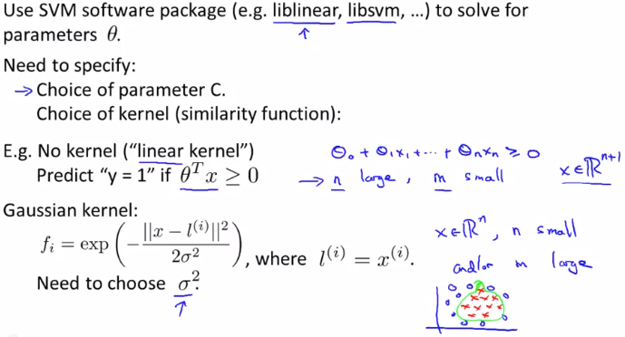
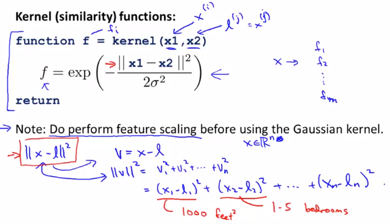
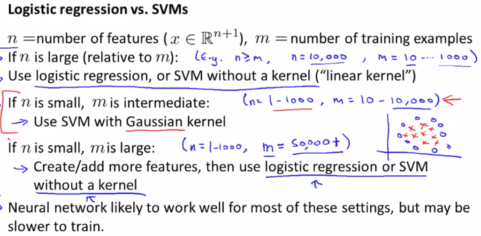

# Using An SVM
SVMを実践するときの留意事項  

## SVMを実装するときのNote
SVMでパラメタ(θ)を求めるにはライブラリにより提供された関数を使う  
// 頑張れば自分の手でも書けるけど 難しいし最適化されたものが既にあるのでそれを使う  
  
このとき パラメタC と カーネル(SimilarityFunction)の選択が必要  
カーネルとしては カーネルを使用しない(LinearKernelを使用する) と  
GaussianKernelを選択することが多い らしい  

LinerKernel, GaussianKernelは人気のためライブラリで提供されることがほとんどらしい  
もし自分でカーネル実装する場合(x, lを受けfを返す)は  
FeatureScalingが必要なことに留意が必要  
  
例えばx1が1000など大きな値をとり x2は1-5程度の小さな値をとる場合  
FeatureScalingを適用しないと fの値はx1の影響を強く受けすぎた値になってしまう  

## LogisticRegression と SVM どちらを使うか
LogisticRegressionとSVMのどちらを使うのが適切かは 以下の通り場合による
  

* m(=DataSetの数)に対し n(=Featureの数)が多い場合  
  LogisticRegression または LinearKernelを使用したSVM が効果的  
  // DataSetが少ないため 複雑な非線形の関数をFittingするには不十分  
  // かつ 線形関数で十分Fittingが期待できるため  

* mがほどほどで nが小さい場合  
  GaussianKernelを使用したSVMが適切  
  // 非線形のFittingを安定して行えるため(Marginを最大化しながら分類できるため)  

* mが多くて nが小さい場合  
  手動でFeatureを増やしたうえで  
  LogisticRegressionまたはLinerKernelを使用したSVMが適切  
