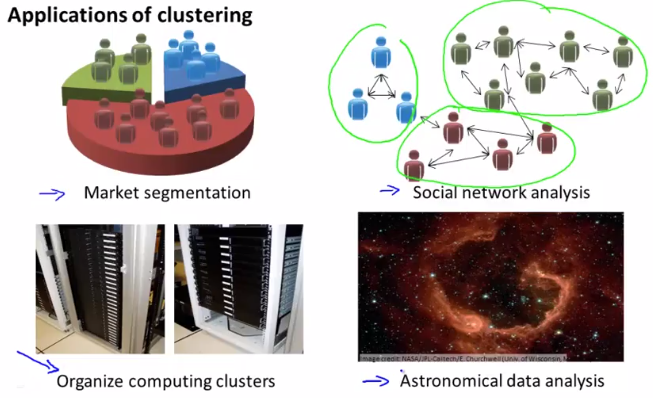

# Unsupervised Learning: Introduction
https://www.coursera.org/learn/machine-learning/lecture/czmip/unsupervised-learning-introduction  
ここからは初めてUnsupervisedLearningについて扱う  
特にClusteringについて扱う  

## Clusteringとはなにか
ClusteringはUnsupervisedLearning  
UnsupervisedLearningとは 学習データにラベル(答え, y)が与えられないもの  

Clusteringでは 与えられたデータから データのstructure(構造?)を見付けることで  
データをグルーピングすることができる  

これは例えば以下のようなケースで用いられる  
  
右上のSocialNetworkAnalysisでは人々を同質なグループへクラスタリングする  
ということに使われるらしい  
