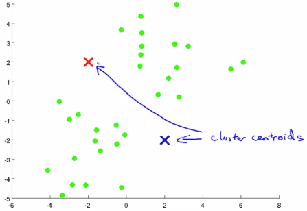
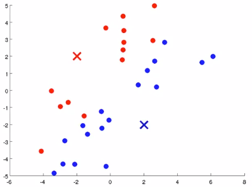
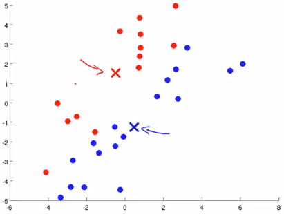
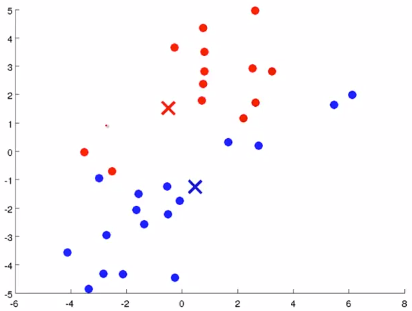
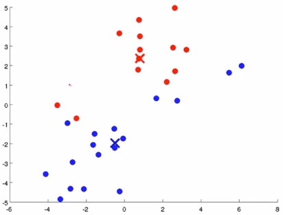
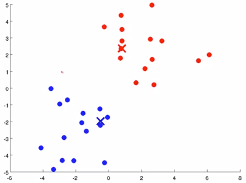
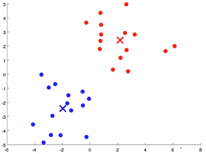
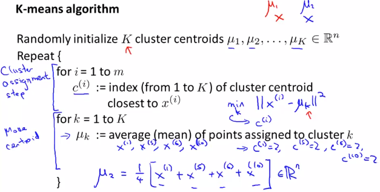

# K-Means Algorithm
https://www.coursera.org/learn/machine-learning/lecture/93VPG/k-means-algorithm  
ClusteringアルゴリズムのK-Meansについて扱う  

## K-MeansのClusteringの考え方
K-Meansアルゴリズムは以下2つのステップでClusteringする  
1. Cluster assignment ステップ
1. Centroid(重心)を動かす ステップ

最初のステップとして まず 適当なクラスタCentroidを決め(以下 赤× と 青×)  
DataSet(緑点)がどちらのCentroidに近いか求める  
  
近いものを同色で表すと以下になる  
  

次のステップとして Centroidを動かす  
同色でグルーピングされたDataSetの平均点を求め Centroidをそこへ動かす  
  

Centroidが動くと DataSetの近いもの(同色として扱うべきもの)が変わるので  
グルーピングし直し その後で再度Centroidを動かす これを繰り返す  

  

繰り返していると やがて収束する  
  
K-Meansでは このようにしてClusteringする  

## K-Meansの入力(パラメタ)
K-Meansは2つの入力を取る
* K: データの中から見つけだしたいClusterの数  
  この数をどのように決めたら良いかは 後ほど教えてくれるらしい  
* TrainingSet: 教師なし学習なので{} yはなくxだけ  

## K-Meansのアルゴリズム
K-Meansのアルゴリズムは以下の通り  
  
1. K個のClusterCentroidsをランダム値で初期化(μとする)  
1. 以下を収束するまで繰り返す  
	1. 各TrainingSet()の最も近いClusterCentroid()を求め  
	にのIndex(k)を設定する    
	1. 各ClusterCentroidについて 同種としたTrainingSetの平均点を求め
	に覚える  
	1. (μが変わっているため 収束するまで繰り返す)
