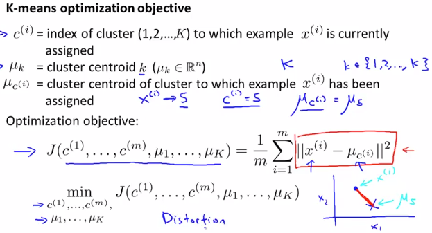
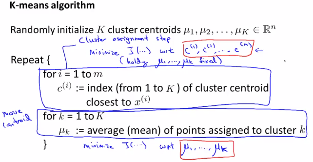

# Optimization Objective
https://www.coursera.org/learn/machine-learning/lecture/G6QWt/optimization-objective  
K-Meansの OptimizationObjective(=CostFunction?)について扱う  

OptimizationObjectiveを知ることで以下に役立つ
## K-MeansのOptimizationObjectiveの考え方
* デバッグ  
* なぜ局所的最小値が回避できるのか理解する(こっちが大事 詳しくは後ほど教えてくれる?)  

OptimizationObjectiveで利用する変数は以下  
*  : がどのクラスタに割り当たっているかトラックするための変数(μのindex)  
*  : index=kのClusterCentroidの場所  
*  : に割り当たっているクラスタの場所  
  は割り当たっているクラスタμのindexのため  

OptimizationObjectiveは以下  
  
と間の距離を最小化することが目的  
DistortionFunctionとも呼ぶ  

## K-MeansのOptimizationObjectiveのAlgorithm
Alogirthmは以下  
  
1. K個のClusterCentroidをランダム初期化する  
1. (収束するまで?)以下を繰り返す  
	1. は固定したまま Costを最小化する, , ..., を求める  
	つまり index=iのDataに最も近い ClusterCentroidのindexをに設定  
	これを全Dataについて求める  
	1. 全ClusterCentroid(μ)について 当該Clusterに割り当たっているDataの平均を設定する  
	// ClusterCentroid()を移動する  
