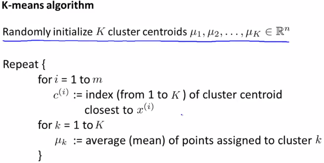
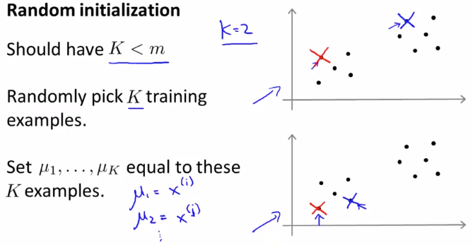
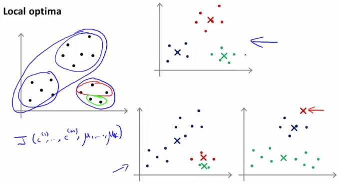
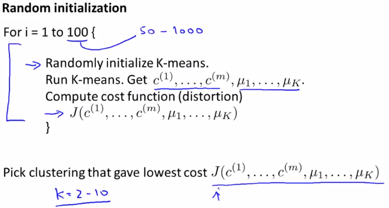

# Random Initialization
https://www.coursera.org/learn/machine-learning/lecture/drcBh/random-initialization  
K-MeansのClusterCentroid初期化の仕方について扱う  

## ClusterCentroid初期化の仕方
K-MeansのAlgorithmは前回扱った通り まずClusterCentroidのランダム初期化が必要  
  

推奨する初期化の方法は以下の通り  
  
* まず K(見つけだしたいClusterの数)は m(Dataの数)より小さくすべき  
// これは直感的にも そうすべきと考えられる  
// Cluster数:Data数 が 1:1 や 2:1 になると  
// Clusterに属するDataが1つになるものや0になるものがあり Clusterが適切に作れないため  
* TrainingExampleからK個をランダムに選択し ClusterCentroid(μ)の初期値にする  

## Local Optimaの回避方法
ClusterCentroidの初期値の選択によって 以下の通りLocalOptimaになってしまうことがある  
  
上のようにClusterCentroidが選択されれば GlobalOptimaが求められるが  
下のようにClusterCentroidを選択してしまうと LocalOptimaが求められてしまう  

GlobalOptimaを求めるには以下が有効  
  
つまり TrainingExampleからK個をランダムに選択 を100回程度おこない  
それぞれについてCostを求め その中からCostが最小になるものを選択すれば良い  

ちなみに GlobalOptimaを求めるこの方法は Kの数が2から10程度のときに有効で  
Kが100など多いときは 必ずしも実施する必要はない  
// たしかに Kの数が多ければ TrainingExampleから選択する数も増え  
// 自然と ClusterCentroid初期値が散らばり LocalOptima回避できる気がする  
// ちなみに ClusterCentroidが同値になるものが出ちゃったときは  
// 1つだけ残して取り除け(Kの数は減っちゃうけど)って話がweek8の2回目?にあったように思う  
