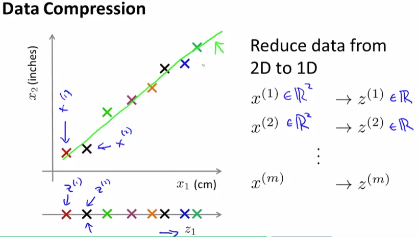
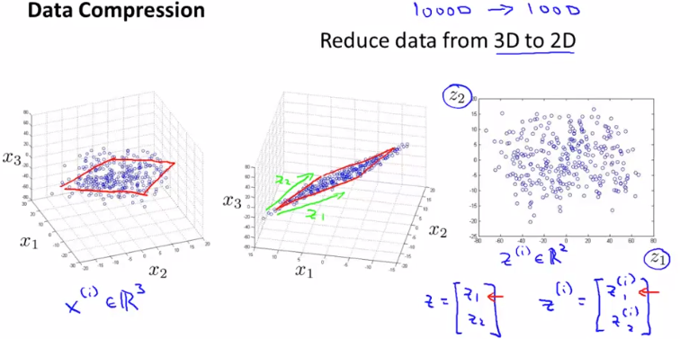

# Motivation I: Data Compression
https://www.coursera.org/learn/machine-learning/lecture/0EJ6A/motivation-i-data-compression  
UnsupervisedLearningのSecondTypeとしてDimensionalityReductionを扱う  
// DimensionalityReductionはUnsupervisedLearning？  
// 教師なし学習の1種と言うより Featuresの最適化手法なだけのような...  
// ここの記載は後で見直して修正する  

## DimensionalityReductionのイメージ 2D -> 1D
x1として長さ(単位:cm) x2として長さ(単位inches) の2次元Featureがあるとき  
これは単位が違うだけの同じ情報で冗長なため 次元を減らし 1次元Featureにすべき  
次元を減らすための考え方は以下の通り  
  
つまり 2次元Featureに関しては 出来るだけDataを載せられる直線を引き  
その直線上でFeatureを表現するイメージ これをz^(1), z^(2), ..., z^(m)として扱い  
それぞれx^(1), x^(2), x^(m)のかわりに用いる  
// ちなみに cm/inch以外で紹介されていた例が あるケースでは  
// skillとenjoymentに高い相関があったため これも次元削減できた という例  

次元削減することで ディスク・メモリの節約もできるが 最も有効な効果は  
アルゴリズムを高速化できること(らしい) 詳しくは後ほど説明してくれる(?)  

## DimensionalityReductionのイメージ 3D -> 2D
3次元を2次元にDimensionalityReductionする場合も基本的には同じで  
3次元のFeaturesを平面(2次元)上で表現するイメージ  
  
