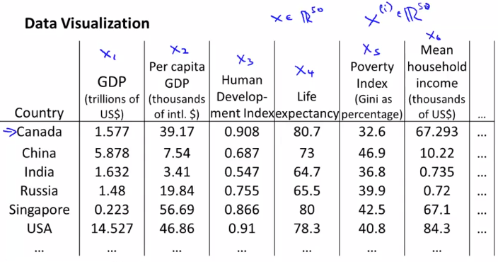
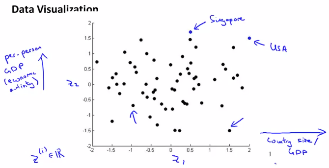

# Motivation II: Visualization
https://www.coursera.org/learn/machine-learning/lecture/t6pYD/motivation-ii-visualization  
DataのVisualizationについて扱う  

## Visualizationの方法
以下のようにFeatures数が50など多い場合 Dataを可視化(グラフにプロット)できない  
  

DimensionalityReductionを用いてFeatures数を 2 or 3 に削減することで  
Visualization(グラフへのプロット)が可能になる 今回は以下の通り2次元(z1, z2)にする  
  

2次元Data(z1, z2)のため 以下の通り 2次元グラフへDataをプロットできる  
  
z1, z2が持つ情報は上記の通りのため  
右上のDataは GDP および 1人あたりのGDPが高い国であることが 視覚的に分かる  
