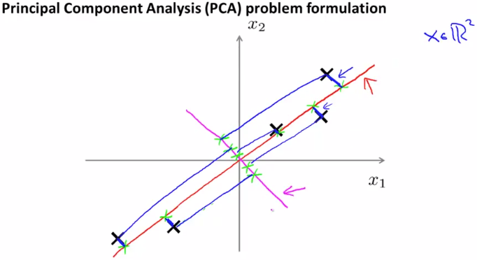
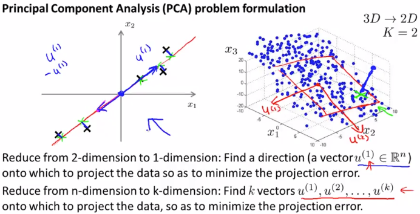
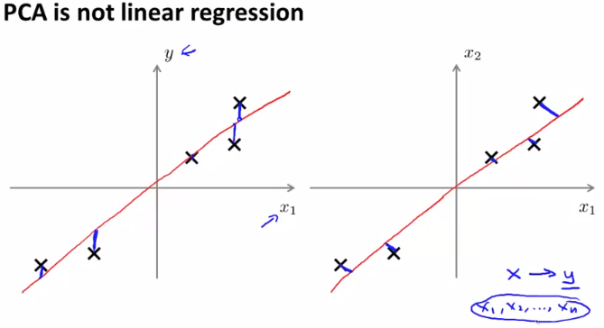

# Principal Component Analysis Problem Formulation
https://www.coursera.org/learn/machine-learning/lecture/GBFTt/principal-component-analysis-problem-formulation  
DimensionalityReductionのアルゴリズムPrincipalComponentAnalysis(PCA)について扱う  

PCAは最も 人気・よく使われている DimensionalityReductionのアルゴリズム らしい  

## PCAの考え方
Featureを2Dから1Dへ変換する場合 以下の通り直線をとり そこへFeatureを射影するのであった  
  
このとき 射影する直線は マゼンタ色線でなく 赤色線を採用したい  
つまり 青線=採った直線・Features間の距離(ProjectionError)の2乗和を最小化する直線を採りたい  

n次元からk次元に削減する場合の考え方も同じ
1次元へ削減する場合は直線とのProjectionErrorを最小化  
2次元へ削減する場合は平面とのProjectionErrorを最小化  
k次元へ削減する場合も同様でkベクトルとのProjectionErrorを最小化を考えれば良い  
  

## PCA と LinearRegressionの違い
誤差(Error)を最小化する点が共通のため  
PCAとLinearRegressionが同じことをやっているようにも勘違いするが 実際は異なる  
  
左のグラフは ひとつのFeature(x)から yを予測するLinearRegressionだが  
最小化している誤差は 関数のy(予測値) と 実測値y の差(≠点と直線の距離) で  
右グラフのPCAが最小化している誤差=点と直線の距離 とは異なる
