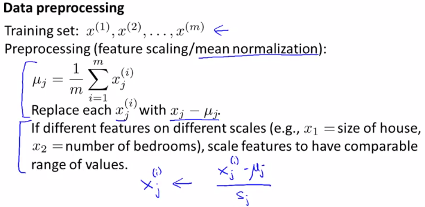
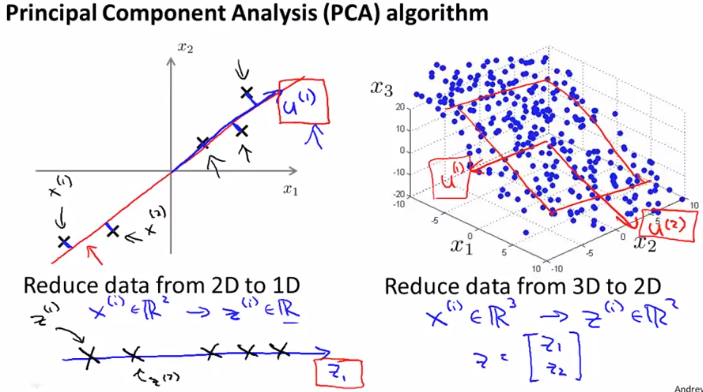
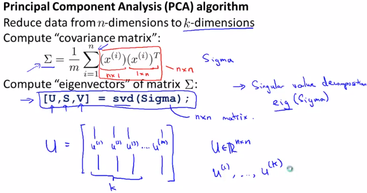
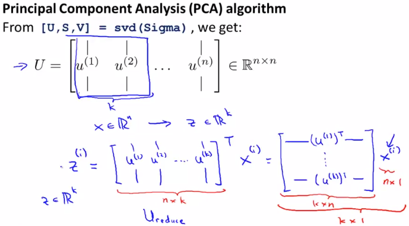
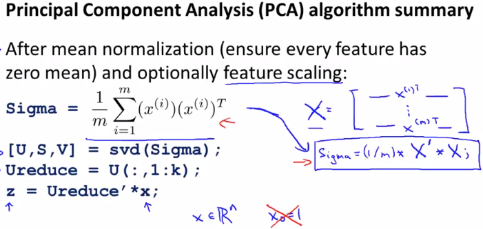

# Principal Component Analysis Algorithm
https://www.coursera.org/learn/machine-learning/lecture/ZYIPa/principal-component-analysis-algorithm  
PCAのアルゴリズム・実装方法について扱う  

## PCAのアルゴリズム
PCAを実行する前にData(Feature)の前準備を行う必要がある  
  
* FeatureScaling: Feature j毎に平均を求め それを各xから引くこと  
* MeanNormalization: Feature間で値域が異なる場合は  
	同様に平均で引いた値を適当なsj(例えば max-min や Feature jの標準偏差)で割ること  

前準備が終わった後PCAでやりたいことは 前回までに扱ってきた通り  
例えば3次元を2次元に削減したい場合は 以下のu1, u2, z1, z2を求めること  
  

そのためには まず共分散行列(convariance matrix)を求める必要がある  
// 共分散行列がなんなのか分からない...  
// 実装する上では理解できなくても出来るっぽいのでひとまず理解は後回しにする  
ConvarianceMatrixはΣで表され n * nの行列  
// 総和を示す記号と被るけど どちらを意味するかは文脈から分かる  
ConvarianceMatrixで求めた値(Sigma)を用いてeigenvectorsをsvd関数により求める  
// eigenvectorsもなんなのか理解できていない...  
  
求めたいeigenvectorsは第1戻り値(U)に設定されている  
UはSigmaと同じ n * nの行列  

zはUを使用し以下の通り求められる  
  
Uの先頭から求めたい次元数(k)分 取り出す これをとする  
これにx^(i)を掛ければz^(i)は求められる  
// らしい...今回なぜなのか理解できていない  
この方法で求めると zはkベクトルが求められており 意図通りの次元数になる  

## PCAの実装方法
このアルゴリズムをOctaveで実装すると以下  
  
