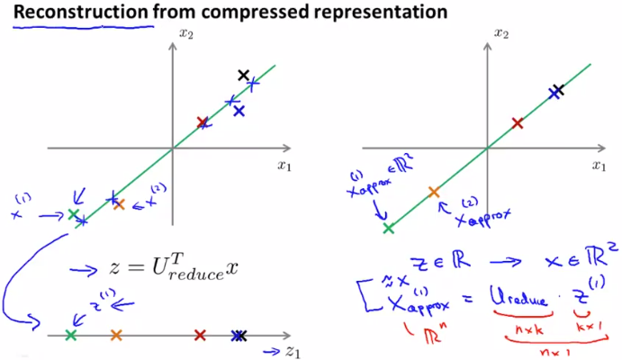

# Reconstruction from Compressed Representation
https://www.coursera.org/learn/machine-learning/lecture/X8JoQ/reconstruction-from-compressed-representation  
DimensionalityReductionしたzから元のxを復元する方法について扱う  

## 次元を復元する方法
 は  
`k*n行列 * n*1行列` により `k*1行列`を求めることで次元削減するのだった  
なので 次元を復元したいのであれば  
`n*k行列 * k*1行列` により `n*1行列`を求めることで元の次元を復元できる つまり  
で求められる
  
