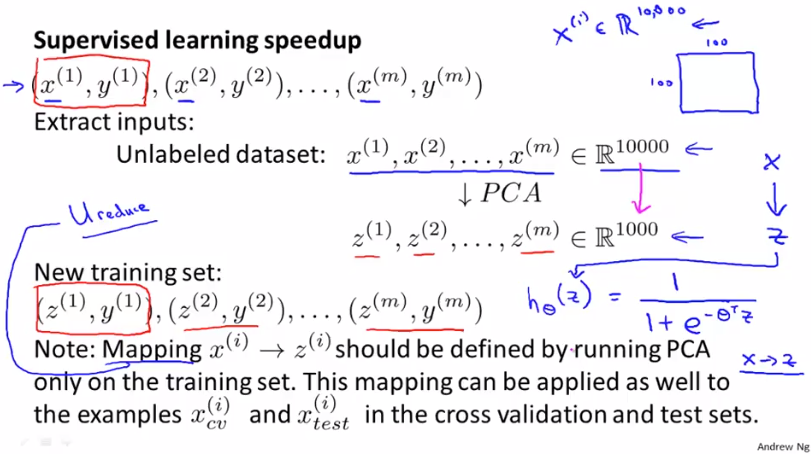
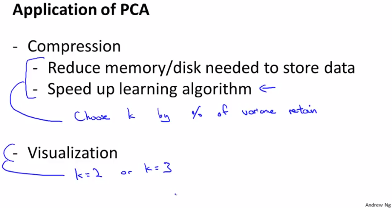
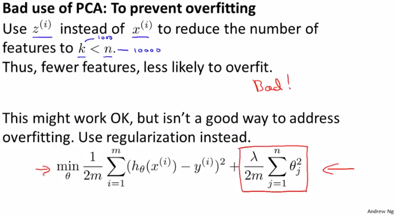

# Advice for Applying PCA
https://www.coursera.org/learn/machine-learning/lecture/RBqQl/advice-for-applying-pca  
PCAを実践でどのように使用すべきかについて扱う  

## PCA用途 学習の高速化
PCAの主な用途が学習の高速化のため  
例えば`100pixel*100pixel`画像の場合Featureは10,000になり 学習に時間がかかる  
このFeatureにPCAを適用することでFeatureを例えば1,000に減らせることが期待できる  
Featureが減れば 学習の高速化が見込める  
  
PCAを適用し学習するためには TrainingSetからxだけを取り出し(yは取り出さない)  
これをPCAに指定しzを得て このzとオリジナルのyを用いて学習すれば良い  

PCAに指定し次元削減するのはTrainingSetだけに限定すべきで  
CV Set や TestSetにはPCAを適用すべきでない  

## PCA用途2 Compression, Visualization
PCAの用途として 他にCompression と Visualizationがある
// どちらも既に出てきているので詳細は省略  
  
Compressionは高速化と同じ話と思う 高速化だけでなく メモリ・ディスク必要量も減らせる  
この用途でのkは前回扱った通り オリジナルデータの分散を保てる値を採用すべき  
Visualization用途でのkは プロットできるのが2D/3Dまでなので 2または3になる  

## PCA誤用1 OverFitting防止
PCAを誤用しているケースとして OverFitting防止に使用するケースがある  
OverFitting防止にはFeature数を削減することが有効なため PCAでFeatureを減らすことで  
たしかにOverFitting傾向の改善には効果がある  
ただし PCAは多少なりともオリジナルデータからデータが落ちる  
それに重要データが含まれないとも言い切れないので OverFitting防止にPCAを利用すべきでない  
  
OverFittingの防止には 以前扱った通り Regularizationを利用すべき  

## PCA誤用2 OverFitting防止
PCAを誤用している別のケースとして MachineLearningシステムを考える際  
最初から無条件でPCAを適用するものがある  
  
まず オリジナルデータで学習し そこで 学習速度が遅い や
メモリ・ディスク不足 などが起こったらPCA適用を検討すべき  
これが誤用の理由はOverFitting同様 重要データが落ちる可能性があること や  
PCAを検討・実装するのにもコスト(人手・時間)がかかるため
