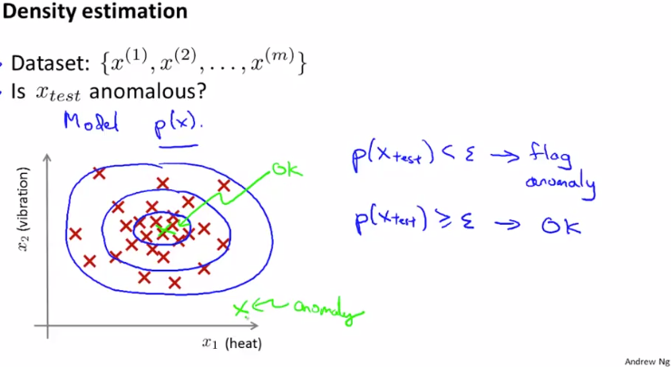
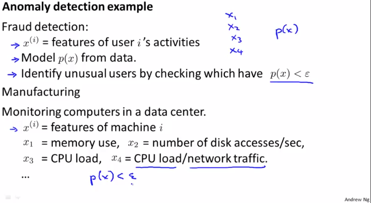

# Problem Motivation
https://www.coursera.org/learn/machine-learning/lecture/V9MNG/problem-motivation  
ここからは 教師なし学習AnomalyDetectionについて扱う  
AnomalyDetectionは教師なし学習だけど 教師あり学習にも見える側面がある らしい  

## AnomalyDetectionとはなにか
例えば エンジンのQAにAnomalyDetectionを適用する場合  
過去のエンジン(Dataset)が以下赤×で示す要素で // このDatasetにラベル(y)は無い  
NewEngines=緑×のFeatureのとき  
赤×と異なる傾向を持つ緑×はAnomaly(異質)とみなすことができる  
AnomalyなNewEngineは追加テストをする必要があると考えられる  
  

## AnomalyDetectionを実現するためのモデル
AnomalyDetectionするためには  
以下Datasetが密集している中心では 高い値を示し  
密集度が低い場合は低い値を示す モデルp(x) があれば良い  
  
TestSet()をこのモデルに指定し  
ある閾値(ε)を下回ればAnomalyと見なすことができる  

## AnomalyDetectionを使用例
AnomalyDetectionは以下のようなケースで用いられる  
* 詐欺の検知: ECサイトで以下Featureを用いてUnusualユーザを検知  
		ログイン頻度, 訪問ページ総数, フォーラム投稿数, タイピング速度
* 製造: 上記で挙げたエンジンのQAのケース
* Datacenterのモニタリング: 以下に記載のFeatureを用いて  
	Downしそうなものを検知 システム管理者にレビューを依頼  
  
