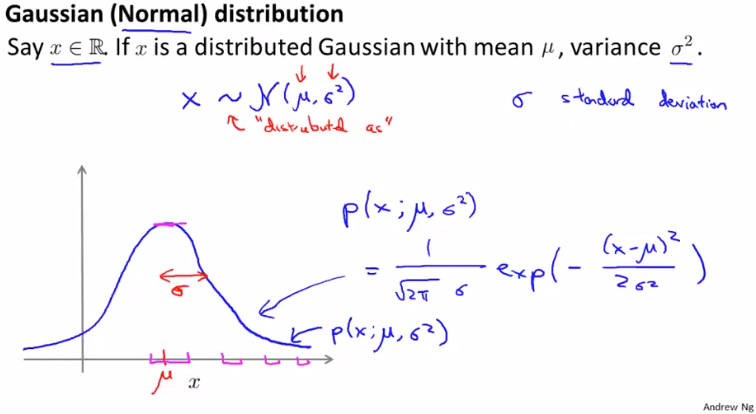
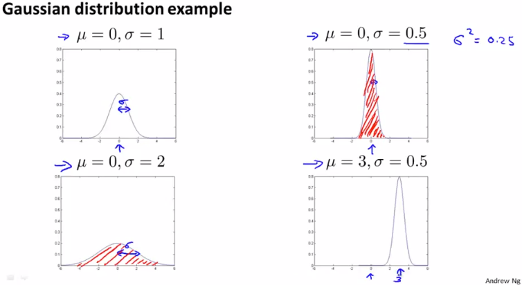
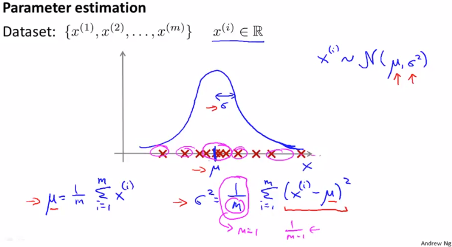

# Gaussian Distribution
https://www.coursera.org/learn/machine-learning/lecture/ZYAyC/gaussian-distribution  
AnomalyDetectionを考えるために必要なガウス分布について扱う  

## ガウス分布とは なにか
xが実数で 平均がμ 分散がのとき  
xの分布は と表すことができ  
// ~は分布が等しいことを示し NはNormalの略 Nは2つのパラメタμとを持つ を示している    
このGaussianDistributionをプロットすると以下の通りベル型のカーブを描く  
  
μはカーブの中心を指し σは幅(標準偏差)を指す  
このカーブはxが それぞれの値(横軸)を採る確率(縦軸)を示している  
// 真ん中を採る確率が最も高く 離れれば離れるほど確率は減っていく  

このGaussianDistributionの式はと表すことができる  
// xの確率はによりパラメタライズされていることを表す  
ちなみに p(x)を求める式は暗記する必要はなくて 必要なとき調べれば良いよとのこと

## ガウス分布のパラメタの作用
ガウス分布のパラメタμ, σは以下のように作用する  
  
ガウス分布は確立を示すため 赤色で塗りつぶされた部分の合計は必ず1になる  
また σは幅を示すため 半分になればそれぞれの確率は倍になるし 倍になれば半分になる  

## ガウス分布のパラメタの求め方
以下赤×で示すDataがあるとき μ, σは以下の通り求めれば良い  
  
つまり μはxのただの平均で σはxから平均を引いて適当な定数で割った値  
// σを求めるときの割る値として`1 / m - 1`を挙げてくれているのはGaussianDistributionで  
// よく使われる値だから MachineLearningでは`1 / m`を使えば良いとのこと  
