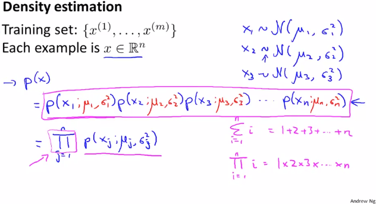
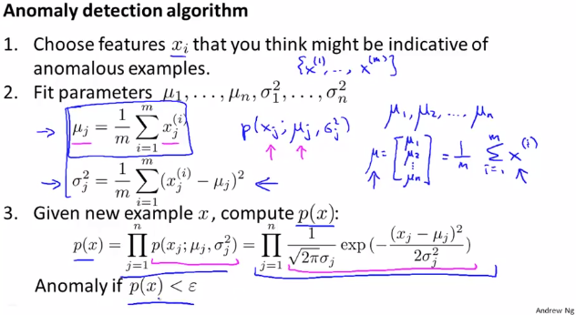
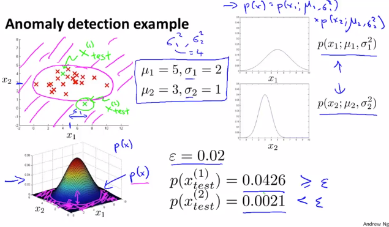

# Algorithm
https://www.coursera.org/learn/machine-learning/lecture/C8IJp/algorithm  
AnomalyDetectionのアルゴリズムについて扱う  

## AnomalyDetectionの考え方
m個のTrainingSetがあり それぞれn個のFeatureを持つ場合について考える  
FeatureがGaussianDistributionに従って分布していると仮定すると  
// GaussianDistributionとは前回扱った通り Featureがある値を採る確率  
`x1がある値を採る確率 * x2がある値を採る確率 * ... * xnがある値を採る確率` を  
以下のp(x)で考えることができる (これをDensityEstimationとも呼ぶ)  
  
はj番目のFeatureのGaussianDistributionを指す  
Π(LargePi)は総乗を指す記号 // Σ(総和)と似たもの  

## AnomalyDetectionのアルゴリズム
AnomalyDetectionのアルゴリズムは以下の通り  
  
1. Feature(x_{i})を選ぶ  
	対象Dataが普通か(/Anomalyか)判断できるFeatureであることが望ましい  
1. 各Feature(j)について `パラメタ = 平均(μ) と 分散(σ^{2})` を求める  
1. 求めたパラメタを利用し TestDataについてp(x)を求める  

## AnomalyDetectionの例
以下 赤×のDataSet(x_{1}, x_{2})があるとき  
パラメタ(分散, √平均=標準偏差)は以下の通り求められる  
  
ここに緑×のTestSetが与えられたとき求めたパラメタから p(x_{test})を求められる  
定めた閾値ε(この値をどう定めれば良いかは後ほど教えていただけるらしい)と比較することで  
対象のTestSetがAnomalyかどうか 決めることが出来る  
