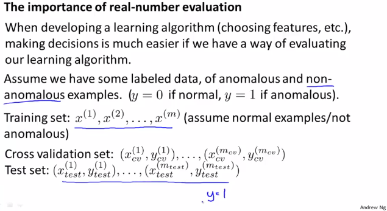
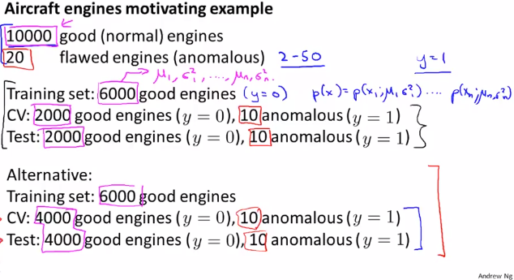
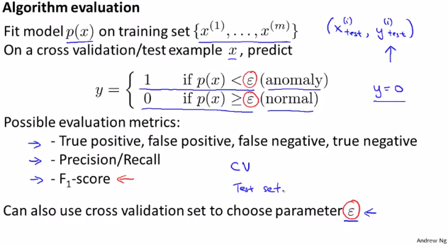

# Developing and Evaluating an Anomaly Detection System
https://www.coursera.org/learn/machine-learning/lecture/Mwrni/developing-and-evaluating-an-anomaly-detection-system  
具体的にどのようにAnomalyDetectionを用いるか ここでは特にEvaluatingについて扱う

## AnomalyDetectionにおいてのEvaluatingの有用性
関数のEvaluation(評価)を実数(1つの値)で行なう重要性は以前にも扱った  
AnomalyDetectionでもEvaluation使うことが出来れば 以下を判断する際に有用  
* どのFeatureを使うか  
* 閾値(ε)として どの値を適用するか  
  
ラベル(y)付きのDataがあればAnomalyDetectionのEvaluatingが可能  
// AnomalyDetectionではラベルyを Anomalyなら1 として扱う

## AnomalyDetectionのEvaluatingにおけるDataSetの分割方法
例えば 10000件のGood/NormalなData 20件のAnomalousなDataがある場合  
// AnomalousなDataは一般的に20-50件程度  
このDataをTrainingSet/ CV Set/ TestSetとして以下のように分けEvaluatingする  
  
上記にある通り TrainingSetには y=0(Good/Normal)なデータのみを用いるのが一般的  
// 多少なら AnomalousなDataが混じるのもOKらしい  
また上記にある通り CVとTestに同じDataを用いてしまっているケースも見受けられるらしいが  
これはやるべきでないとのこと // 教師あり学習などAnomalyDetection以外でも出てた話と同じ  

## AnomalyDetectionのEvaluationのアルゴリズム
以下の通り TrainingSetでAnomalyDetectionでパラメタを求め  
求めたパラメタを使い CV/Test Set でAnomalyDetectionを実際にして ラベルと比べれば良い  
  
上記の通り AnomalyDetectionは Normal/Good(y=0)が Anomaly(y=1)に比べ  
非常に多いSkewed(歪んだ)Classes(全部0に分類しちゃえば非常に高いAccuracyになる)
// SkewedClassesはweek6/09_ErrorMetricsForSkewedClassesで扱ったものと同じ  
そのため EvaluatingにはPrecision/RecallやF1-scoreを適用し 求める必要がある  
