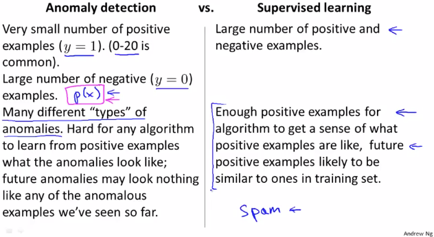
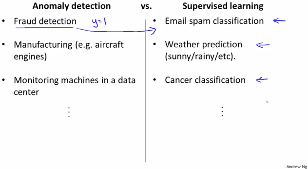

# Anomaly Detection vs. Supervised Learning
https://www.coursera.org/learn/machine-learning/lecture/Rkc5x/anomaly-detection-vs-supervised-learning  
AnomalyDetectionとSupervisedLearningの使い分けについて扱う  

前回扱ったように Dataにラベル(y)があるときでも AnomalyDetectionを用いることがある  
ラベル(y)があるためSupervisedLearningも用いることができる 有効に使い分けるべき  

## AnomalyDetectionとSupervisedLearningの使い分け
主に以下の特徴に従い使い分ける  

* AnomalyDetectionが有効なケース  
	* 陽性Data(y=1のData)が非常に少なく 陰性Data(y=0)が多い場合  
	* Anomalyの種類が豊富な場合  
		y=1と分類すべきDataSetの種類が豊富でアルゴリズムがその傾向を掴むのが難しそうな場合  
	* 未知(DataSetに含まれない)の種類のAnomalyが多そうな場合  
		これも↑と同じでy=1と分類すべきものをアルゴリズムで傾向掴むのが難しそうということ  
* SupervisedLearningが有効なケース  
	* 陽性(y=1)と陰性(y=0)のDataがどちらも豊富にある場合  
	* 陽性(y=1)に分類すべきDataが過去Data(TrainingSet)と似た傾向を持つ場合  
		y=1と分類すべきDataSetの傾向をアルゴリズムで傾向を掴むことができそうな場合  

  

ちなみに過去取り上げたメールがスパムかどうか分類するケースはSupervisedLearningが有効  
スパムメールと分類すべきメールの種類は豊富だが 十分なスパムメールのDataSetがあるため  

## 使い分けの具体例
具体的なケースでは以下の通り使い分ける  
  
Fraud(詐欺)検知 や 製造不良検知 などは 陽性データ多くないため AnomalyDetectionが有効  
スパムメールの分類などはSupervisedLearningが有効  
