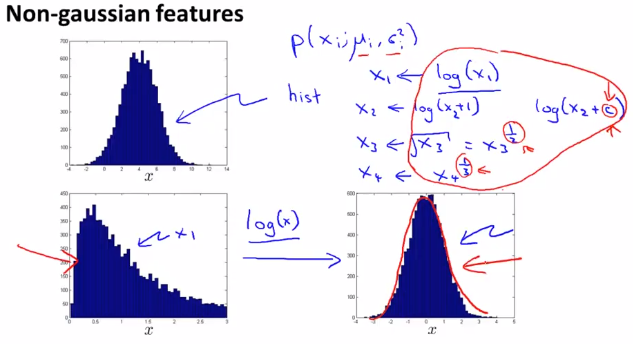
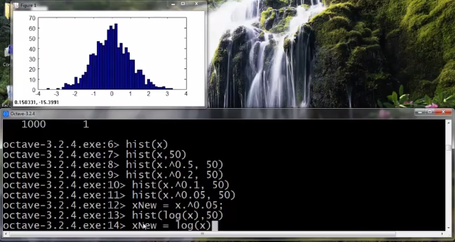
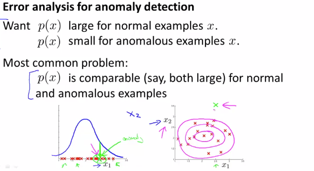
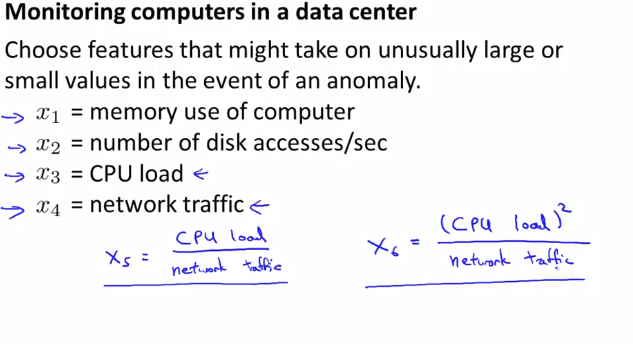

# Choosing What Features to Use
https://www.coursera.org/learn/machine-learning/lecture/LSpXm/choosing-what-features-to-use  
AnomalyDetectionでFeatureを どう選べば良いか デザインすれば良いか について扱う  

AnomalyDetectionが上手く機能するかには Featureの選択が非常に大きな影響を与える  
// らしい それぞれのFeatureからAnomalyか判断するので直感的にもそう思う  

## Non-GaussianなFeatureの変換
FeatureをAnomalyDetectionに使う前に 分布をプロットすることは有効 プロット結果が  
以下の上段のとき ガウス分布っぽいのでAnomalyDetectionのFeatureとして良さそう  
下段の左側のとき このままでもAnomalyDetectionは一応できるらしいけれど  
下段の右側のように変換してから Featureとして使う方が最適らしい  
  
変換するためには 上記にある通り logをとってみたり √をとってみたりすることが多いらしい  

Octaveでは hist関数を用いることで 変換しながら分布をプロットできるため便利  
    

## Featureの選び方
AnomalyDetectionに指定するFeatureをどう選べば良いかは  
week6/08_ErrorAnalysisで扱った教師あり学習のときのErrorAnalysisと似た考え方を採る  
  
まず AnomalyDetectionしてみて上記の左のようにDataSetが赤×でプロットされるとき  
AnomalyなDataをプロットして緑×になってしまう場合 正しくAnomalyとは分類できない  

こうなったときは NormalなData と AnomalyなData を見比べて  
見分けるのに有効そうなFeatureが他にないか考えてみる必要がある  
上記x2のように Anomalyのときに外れ値を採るFeatureを選択する必要がある  

## Featureの選び方 具体例
Anomalyなとき 非常に 大きな/小さな 値になるFeatureを選択することが望ましい  
DatacenterのComputerをモニタリングする例でFeatureの選び方を具体的に考える  
  
例えば 外部通信を伴わない処理で無限ループに陥っているケースでは  
CpuLoadが大きく上昇し NetworkTrafficは小さくなることが想定される  
そのため x5(やその変型のx6)のようなFeatureを作り・使うことがAnomalyDetectionでは有効  
