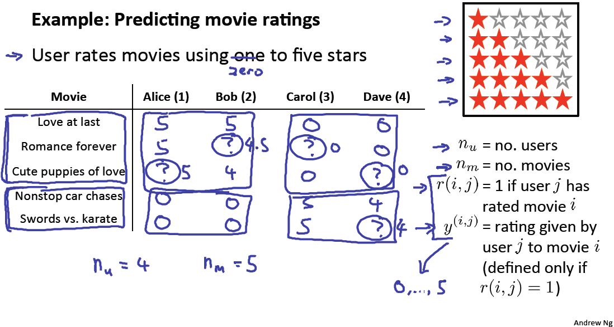

# Problem Formulation
https://www.coursera.org/learn/machine-learning/lecture/Rhg6r/problem-formulation  
ここからはRecommenderSystemsについて扱う  

## RecommenderSystemsとはなにか なぜ扱うか
RecommenderSystemsは推薦システムのことで  
Amazonでおすすめ商品を挙げてくれたり Netflixでおすすめ映画を挙げてくれたり に利用  

今回RecommenderSystemsを扱ってくれる理由は主に2つある らしい  
1. MachineLearningの重要な適用例だから つまり実践でよく使われているから  
	現状(現時点ではまた事情が異なるのだろうか...) 企業成績を上げるのに最も使われている  
1. 特定の状況下では(?)Featureの自動選択を行なうことができるシステムだから(?)  
	MachineLearningではFeatureの選択が非常に重要であることはこれまで扱ってきた通り  
	これまで手動で選んできたが RecommenderSystemsは自動で選択できることがあるらしい  

## RecommenderSystemsの例
映画のRecommenderSystemsを考えるとき 以下となる  
  
4人のUser 5つのMovie があり それぞれのユーザが上記の評価をしているとき  

ProblemFormulationは?(=未評価)を予測(し高Rateと予測されるものをRecommend)すること  
これを解決するのに利用できるのがRecommenderSystems  
