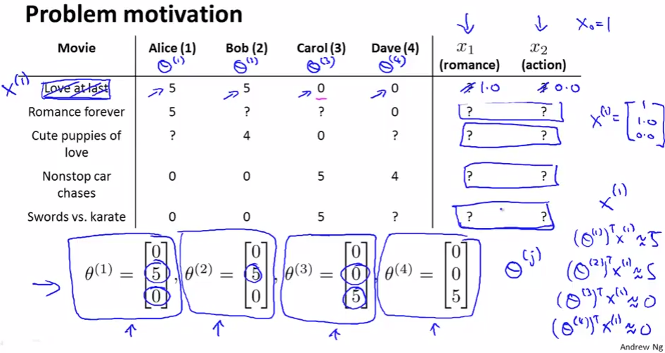
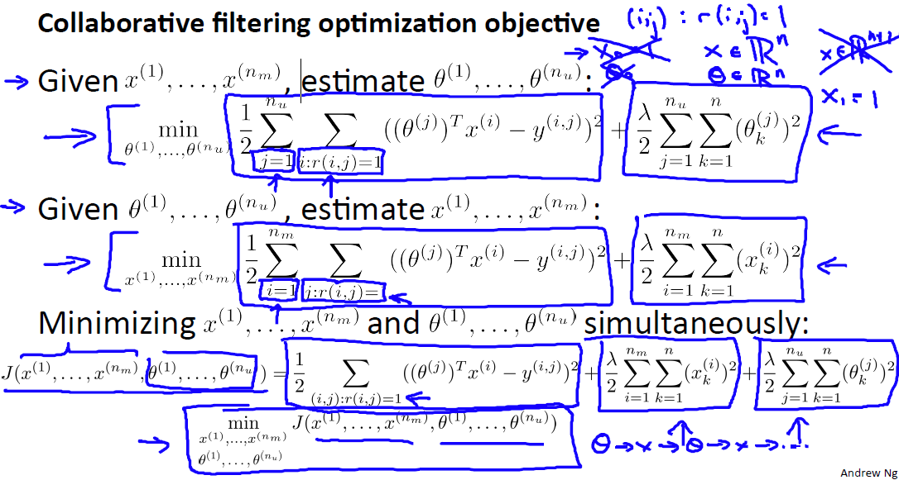
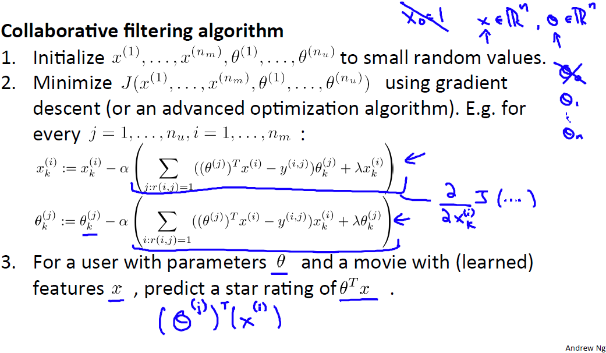

# Collaborative Filtering
https://www.coursera.org/learn/machine-learning/lecture/2WoBV/collaborative-filtering  
RecommenderSystemsのアプローチCollaborativeFilteringについて扱う  
CollaborativeFilteringはFeatureを自動で改善するFeatureLearningの性質を持つ  

## CollaborativeFilteringの考え方
ContentBasedRecommendationsではMovieの性質x1(Romance) x2(Action)を  
何らかの方法で得て それを用いてRecommenderSystemsを構築するのだった  
ただ 実際は全てのMovieについて このようなFeatureを定義するのは難しい  
どうやって得るのかが難しいし 適切な性質を挙げるのも難しい  
なので ここでは以下の通りx1 x2を?と置く  
  
ここで なんらかの方法で各ユーザのθが上記の通り得られたとする  
例えば θ^{(1)}=Aliceは Romanceが好きで Actionは好きでない ことを示す
θがあれば 上記の右下の式にあるようにParameterFittingできれば xは求められそう  

## CollaborativeFilteringのParameterFittingの式
つまり xが与えられればθは見積もることができるし θが与えられればxは見積もることができる  
見積もり際に最小化すべき誤差は以下の通り  
  

ここでxとθは鶏と卵みたいな関係 以下の方法でxとθを改善していくことができる  
1. Initial θを適当に決める それに基づきxを求める  
1. 求めたxに基づき θを求める  
1. 求めたθに基づき xを求める  
1. 繰り返して 最適化する  

以上の手順でFeatureLearningできる  

このアプローチは 各Userが複数MovieをRatingしており  
また 複数UserからMovieがRatingされることで実現が可能になる  

このように たくさんのUserによりCollaborativeにFeature改善が行われるため  
CollaborativeFilterと呼ばれる  
