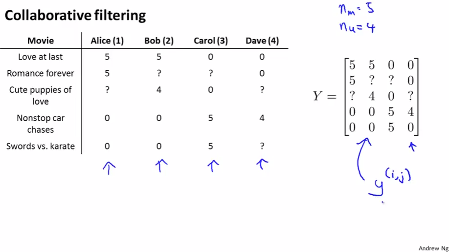
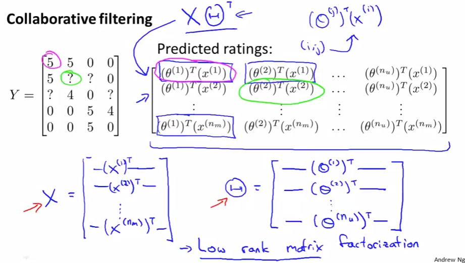
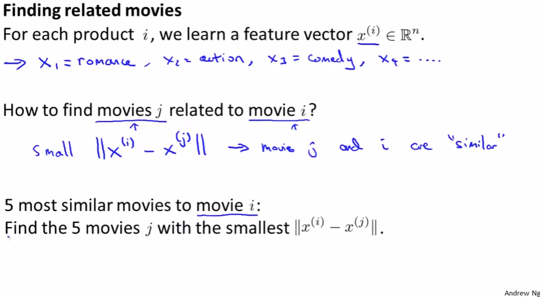

# Vectorization: Low Rank Matrix Factorization
https://www.coursera.org/learn/machine-learning/lecture/CEXN0/vectorization-low-rank-matrix-factorization  
CollaborativeFilterAlgorithmのベクトル化について扱う  
// LowRankMatrixFactorizationはCollaborativeFilterAlgorithmの別名らしい  

また ある映画・商品(など)と似た特徴を持つと予想されるものを見付ける方法についても扱う  

## CollaborativeFilterAlgorithmのベクトル化
5つのMovie 4人のUser が居るとき YはMatrixで以下の通り表現できる  
  
Ratedで無い箇所は Yには?を入れとく  
Yの特定成分を指す変数  

Yの各成分はθとxから以下の通り求めることができる  
  
そのため XとΘに上記の通りFeatureとParamterを持つことができていれば  
 で求められる  
ちなみに マゼンタ グリーンで囲った箇所がそれぞれPredictedRatngとYで対応する  
// マゼンタの はユーザ1のMovie1のRateで5に対応  

## 似たFeatureを持つものを探す方法

  
